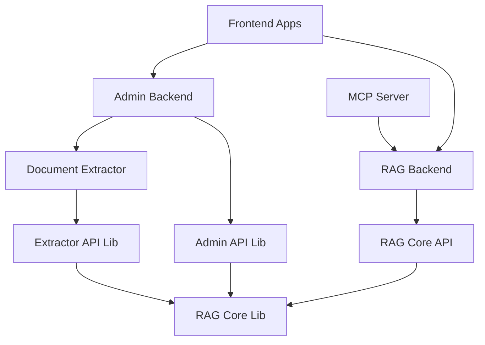

# RAG Template 2.0 - Monorepo

This is a comprehensive RAG (Retrieval-Augmented Generation) template organized as a monorepo for streamlined development and deployment.

## Repository Structure

```
rag-template-2.0/
├── services/                    # All microservices
│   ├── admin-backend/          # Admin API backend service
│   ├── document-extractor/     # Document extraction service
│   ├── rag-backend/           # Main RAG API service
│   ├── mcp-server/            # Model Context Protocol server
│   └── frontend/              # Frontend applications (Nx workspace)
│       ├── apps/
│       │   ├── admin-app/     # Admin interface
│       │   └── chat-app/      # Chat interface
│       └── libs/              # Frontend shared libraries
├── libs/                       # Shared Python libraries
│   ├── rag-core-lib/         # Core RAG functionality
│   ├── rag-core-api/         # RAG API implementations
│   ├── admin-api-lib/        # Admin API library
│   └── extractor-api-lib/    # Document extraction library
├── infrastructure/            # Deployment configurations
│   ├── rag/                  # Helm charts
│   ├── terraform/            # Infrastructure as code
│   └── server-setup/         # Server configuration
├── tools/                     # Development tools and scripts
│   ├── api-generator.sh      # API client generation
│   └── rag-core-dockerfile   # Shared Dockerfile for libs
└── docs/                      # Documentation
```

## Getting Started

### Prerequisites

- Python 3.13+
- Poetry 1.8.3+
- Node.js 18+ (for frontend)
- Docker (for containerization)
- Make (for build automation)

### Development Setup

1. **Clone the repository**
   ```bash
   git clone <repository-url>
   cd rag-template-2.0
   ```

2. **Install dependencies for all services**
   ```bash
   make update-lock  # Update all Poetry lock files
   ```

3. **Run linting across all services**
   ```bash
   make lint
   ```

4. **Format code across all services**
   ```bash
   make black
   ```

### Running Services

#### Using Docker (Recommended)
```bash
# Build and run all services
docker-compose up --build

# Or use Tilt for development
tilt up
```

#### Individual Services

**Backend Services:**
```bash
# RAG Backend
cd services/rag-backend
poetry install
poetry run python main.py

# Admin Backend
cd services/admin-backend
poetry install
poetry run python main.py

# Document Extractor
cd services/document-extractor
poetry install
poetry run python main.py

# MCP Server
cd services/mcp-server
poetry install
poetry run python src/main.py
```

**Frontend:**
```bash
cd services/frontend

# Chat Application
npm run chat:serve

# Admin Application
npm run admin:serve
```

## Development Workflow

### Making Changes to Shared Libraries

When modifying shared libraries in `libs/`, the changes automatically affect all dependent services due to the `develop = true` flag in Poetry dependencies.

### API Client Generation

After modifying API schemas, regenerate clients:
```bash
./tools/api-generator.sh
```

### Testing

```bash
# Run tests for all services
make test

# Run tests for specific service
cd services/rag-backend
make test
```

### Building Docker Images

```bash
# Build all images
make build_and_push REGISTRY=your-registry IMAGE_TAG=your-tag

# Build specific service
docker build -f services/rag-backend/Dockerfile -t rag-backend .
```

## Architecture

### Service Dependencies



### Shared Libraries

- **rag-core-lib**: Core RAG functionality, LLM integrations, vector databases
- **rag-core-api**: FastAPI implementations for RAG operations
- **admin-api-lib**: Document management and admin operations
- **extractor-api-lib**: Document extraction and processing

## Deployment

### Local Development
Use Tilt for local Kubernetes development:
```bash
tilt up
```

### Production
Use the Helm charts in `infrastructure/rag/`:
```bash
helm install rag infrastructure/rag/
```

### Infrastructure
Terraform configurations are available in `infrastructure/terraform/` for cloud deployment.

## Contributing

1. Create a feature branch from `main`
2. Make your changes
3. Run `make lint` and `make test`
4. Create a Pull Request
5. Ensure all CI checks pass

## Migration from Submodules

This repository was migrated from a multi-repository setup with git submodules to a monorepo structure. The migration preserved all functionality while simplifying the development workflow.

### Benefits of Monorepo Structure

- **Simplified Development**: Single git clone, no submodule management
- **Atomic Changes**: Cross-service changes in single commits
- **Unified CI/CD**: Single pipeline for all components
- **Easier Dependency Management**: Direct path references instead of published packages
- **Better Developer Experience**: Unified tooling and scripts

## Troubleshooting

### Poetry Issues
If you encounter Poetry dependency issues:
```bash
cd services/<service-name>
poetry lock --regenerate
poetry install
```

### Docker Build Issues
Ensure you're building from the repository root:
```bash
docker build -f services/<service-name>/Dockerfile .
```

### Frontend Issues
```bash
cd services/frontend
npm install
npm run nx reset
```

## License

[Your License Here]
