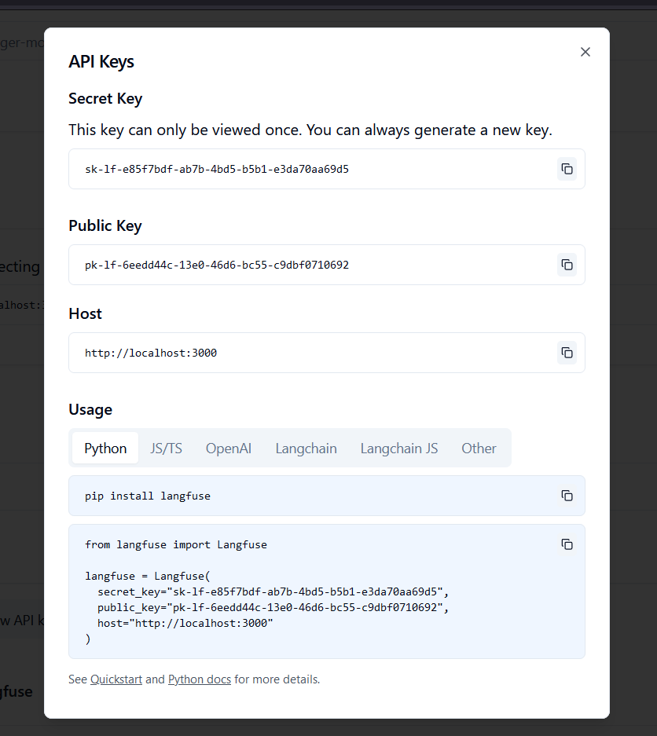

# Introduction 
This is a very basic example of how to use the rag-template.
It also gives an example of how to replace modules of the core template.

Things that are NOT included:
- Document management
- Document parsing

# Getting Started
An example tiltfile is provided to get you started.

## Requirements

> *Windows users*: make sure you use wsl for infrastructure setup & orchestration.

## Local setup instructions

The following is a list of the dependencies. If you miss one of the dependencies, click on the name and follow the install instructions.

- [*k3d*](https://k3d.io/v5.6.0/#installation)
- [*helm*](https://helm.sh/docs/intro/install/)
- [*tilt*](https://docs.tilt.dev/install.html)

For local deployment a view env variables need to be provided by an `.env` file (here: .)

The `.env` needs to contain the following values:

```
BASIC_AUTH=Zm9vOiRhcHIxJGh1VDVpL0ZKJG10elZQUm1IM29JQlBVMlZ4YkpUQy8K
BASIC_AUTH_CLEAR=foo:bar

LANGFUSE_PUBLIC_KEY=pk-lf...
LANGFUSE_SECRET_KEY=sk-lf...

ALEPH_ALPHA_ALEPH_ALPHA_API_KEY=...

STACKIT_AUTH_CLIENT_ID=...
STACKIT_AUTH_CLIENT_SECRET=...
```

This results in a basic auth with username`foo` and password=`bar`.

> 📝 NOTE: All values containg `...` are placeholders and have to be replaced with real values.

> ⓘ INFO: The sit-internal instance of AlephAlpha has proven to be not the most reliable. 
> This deployment comes with multiple options. You change the `global.config.envs.rag_class_types.RAG_CLASS_TYPE_LLM_TYPE` in the helm-deployment to on of the following values: 
> - `myapi`: Uses the sit-internal AlephAlpha instance.
> - `alephalpha`: Uses the public AlephAlpha instance.
> - `ollama`: Uses ollama as an LLM provider.
>
> Both *AlephAlpha* options share the same settings. The default for the *Ollama* option is to use the bundled instance of *Ollama*.

In the following, the *k3d* cluster setup and the setup inside the *k3d* will be explained.

### *k3d* cluster setup

Assumption: You are in the `rag-infrastructure/cluster-setup` directory. A local registry is created at `registry.localhost:5000`.

```shell
bash setup-k3d-cluster.sh
```

Note: only tested under Linux (Ubuntu 22.04 LTS)

In case of error, you have to manually setup the *k3d* cluster and the nginx ingress controller (if necessary).

#### (Optional) Setup-check

Images can be pushed, pulled, removed etc. to/from the local repo, see:

```shell
docker pull busybox:latest
docker tag busybox:latest registry.localhost:5000/busybox:latest
docker push registry.localhost:5000/busybox:latest
docker run --rm registry.localhost:5000/busybox:latest /bin/sh -c "echo '<<< mmmakies say \"hello\" to you ]:-> >>>'"
docker image rm registry.localhost:5000/busybox:latest
```


It is time to check if the cluster works with the local repo :sunglasses: :

```shell
kubectl run test-pod-name --image registry.localhost:5000/busybox:latest -- /bin/sh -c "while true; do echo '<<< mmmakies say \"hello\" to you ]:-> >>>'; sleep 1; done"
kubectl wait --for=condition=ready pod test-pod-name
kubectl logs test-pod-name
kubectl delete po test-pod-name
```

Under linux, *.localhost should be resolved :fire:, otherwise you have to adjust the hosts file. In windows and macOS append the hosts file with the following line:

```shell
127.0.0.1 registry.localhost
```

More information about adjusting the hosts file can be found in the section 'Access via ingress'.


### *tilt* deployment

The following will tear up the microservices in *k3d*.
For the following steps it is assumend your current working directory is the root of the git-repository.

```shell
tilt up
```

Environment variables are loaded from `.env` file.

The tilt ui is available at [http://localhost:10350/](http://localhost:10350/)

If you want to access qdrant etc. just click the resource in the ui. In the upper corner will be the link, to access the resource.

To enable debugging, start tilt with the following command:
'''shell
tilt up -- --debug=true
'''

The backend will wait until your debugger is connected before it will fully start.
The debugger used is `debugpy` which is compatible with Vscode.
To connect the debugger you can use the following `launch.json`:
'''json
{
    "version": "0.2.0",
    "configurations": [
        {
            "name": "rag_backend",
            "type": "python",
            "request": "attach",
            "host": "localhost",
            "port": 31415,
            "justMyCode": false,
            "env": {
                "PYDEVD_WARN_EVALUATION_TIMEOUT": "600"
            },
            "pathMappings": [
                {
                    "localRoot": "${workspaceFolder}/rag-backend",
                    "remoteRoot": "/app"
                }
            ]
        }        
    ]
}
'''

The following will delete everything deployed with `tilt up` command

```shell
tilt down
```

### Access via ingress

To access the ingress by its hostname, the hosts file need to be adjusted. On *linux/macOS*, you have to adjust `/etc/hosts` as follows. 

```shell
echo "127.0.0.1 rag.localhost" | sudo tee -a /etc/hosts > /dev/null
```

Afterwards the services should be accessible from [http://rag.localhost](http://rag.localhost)

Note: The command above has only been tested on *Ubnutu 22.04 LTS*. 

On *Windows* you can adjust the hosts file as described [here](https://docs.digitalocean.com/products/paperspace/machines/how-to/edit-windows-hosts-file/).


# Deployment to server

The `rag-infrastructure' folder contains a tutorial on how to deploy to a server.

# Langfuse

LangFuse utilizes a PostgreSQL database under the hood. After both services are available, browse to the spcified url.
After signing up and creating a project in the local LangFuse instance, create API keys via the settings; see below.




# Build and Test
The example Tiltfile provides a automatic/triggered linting and testing.
The linting-settings can be changed in the `rag-backend/pyproject.toml` file under section `tool.flake8`.


# Usage
The following endpoints are provided:
- `/chat/{session_id}': The endpoint for chatting.
- '/source_documents/remove': Endpoint to remove documents from the vector database.
- '/search': Endpoint to search documents. This is the same search that is internally used when using the chat-endpoint.
- '/source_documents': Endpoint to upload documents into the vector database. These documents need to have been parsed. For simplicity a Langchain Documents like format is used.

For further information on the endpoints please consult the Swagger API.

# Contribute
This use case example contains 2 git submodules, the `rag-infrastructure` and the `rag-core-library`.
In order to contribute you can simply create a new branch, make changes and create a PR.
Keep in mind that only contributions that will work in a general case will be accepted. Use-case specific changes should not be made inside of these submodules.