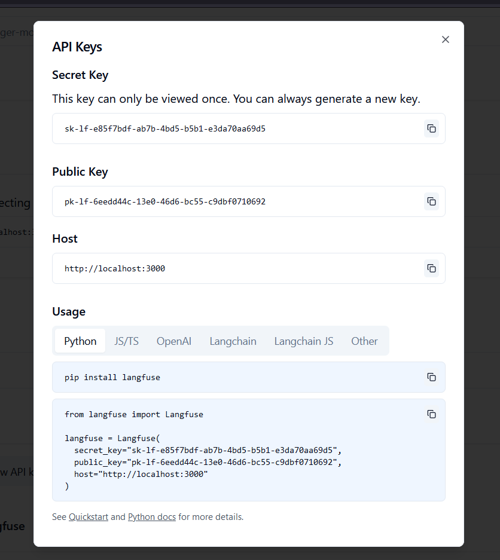

# Requirements

> *Windows users*: make sure you use wsl for infrastructure setup & orchestration.

## Local setup instructions

The following is a list of the dependencies. If you miss one of the dependencies, click on the name and follow the install instructions.

- [*k3d*](https://k3d.io/v5.6.0/#installation)
- [*helm*](https://helm.sh/docs/intro/install/)
- [*tilt*](https://docs.tilt.dev/install.html)

For local deployment a view env variables need to be provided by an `.env` file (here: .)

The `.env` needs to contain the following values:

```
BASIC_AUTH=Zm9vOiRhcHIxJGh1VDVpL0ZKJG10elZQUm1IM29JQlBVMlZ4YkpUQy8K
BASIC_AUTH_CLEAR=foo:bar

S3_SECRET_ACCESS_KEY=password
S3_ACCESS_KEY_ID=admin

LANGFUSE_PUBLIC_KEY=pk-lf...
LANGFUSE_SECRET_KEY=sk-lf...

ALEPH_ALPHA_ALEPH_ALPHA_API_KEY=...

STACKIT_AUTH_CLIENT_ID=...
STACKIT_AUTH_CLIENT_SECRET=...


OPENAI_API_KEY=...


# helmfile required envs
RAG_HOST="rag.localhost"
IMAGE_REPOSITORY="registry.localhost:5000"
IMAGE_TAG="test2"
TLS_ENABLED=false
SSL=false
```

This results in a basic auth with username`foo` and password=`bar`.

> 📝 NOTE: All values containg `...` are placeholders and have to be replaced with real values.

> ⓘ INFO: The sit-internal instance of AlephAlpha has proven to be not the most reliable. 
> This deployment comes with multiple options. You change the `global.config.envs.rag_class_types.RAG_CLASS_TYPE_LLM_TYPE` in `./doctopus/values.yaml` to on of the following values: 
> - `myapi`: Uses the sit-internal AlephAlpha instance.
> - `alephalpha`: Uses the public AlephAlpha instance.
> - `ollama`: Uses ollama as an LLM provider.
>
> Both *AlephAlpha* options share the same settings. The default for the *Ollama* option is to use the bundled instance of *Ollama*.

In the following, the *k3d* cluster setup and the setup inside the *k3d* will be explained.

### *k3d* cluster setup

Assumption: You are in the `infrastructure/cluster-setup` directory. A local registry is created at `registry.localhost:5000`.

```shell
bash setup-k3d-cluster.sh
```

Note: only tested under Linux (Ubuntu 22.04 LTS)

In case of error, you have to manually setup the *k3d* cluster and the nginx ingress controller (if necessary).

#### (Optional) Setup-check

Images can be pushed, pulled, removed etc. to/from the local repo, see:

```shell
docker pull busybox:latest
docker tag busybox:latest registry.localhost:5000/busybox:latest
docker push registry.localhost:5000/busybox:latest
docker run --rm registry.localhost:5000/busybox:latest /bin/sh -c "echo '<<< mmmakies say \"hello\" to you ]:-> >>>'"
docker image rm registry.localhost:5000/busybox:latest
```


It is time to check if the cluster works with the local repo :sunglasses: :

```shell
kubectl run test-pod-name --image registry.localhost:5000/busybox:latest -- /bin/sh -c "while true; do echo '<<< mmmakies say \"hello\" to you ]:-> >>>'; sleep 1; done"
kubectl wait --for=condition=ready pod test-pod-name
kubectl logs test-pod-name
kubectl delete po test-pod-name
```

Under linux, *.localhost should be resolved :fire:, otherwise you have to adjust the hosts file. In windows and macOS append the hosts file with the following line:

```shell
127.0.0.1 registry.localhost
```

More information about adjusting the hosts file can be found in the section 'Access via ingress'.


### *tilt* deployment

The following will tear up the microservices in *k3d*

```shell
tilt up
```

Environment variables are loaded from `backend/.env` file. See [backend README](../backend/README.md#installation--usage) for required variables.

The tilt ui is available at [http://localhost:10350/](http://localhost:10350/)

If you want to access minio/qdrant etc. just click the resource in the ui. In the upper corner will be the link, to access the resource.

To enable debugging, follow instructions in [README](../README.md).

The following will delete everything deployed with `tilt up` command

```shell
tilt down
```

### Access via ingress

To access the ingress by its hostname, the hosts file need to be adjusted. On *linux/macOS*, you have to adjust `/etc/hosts` as follows. 

```shell
echo "127.0.0.1 doctopus.localhost" | sudo tee -a /etc/hosts > /dev/null
```

Afterwards the services should be accessible from [http://doctopus.localhost](http://doctopus.localhost)

Note: The command above has only been tested on *Ubnutu 22.04 LTS*. 

On *Windows* you can adjust the hosts file as described [here](https://docs.digitalocean.com/products/paperspace/machines/how-to/edit-windows-hosts-file/).


## Deployment to server

The following is a list of the dependencies. If you miss one of the dependencies, click on the name and follow the install instructions.

- [*k3d*](https://k3d.io/v5.6.0/#installation)
- [*helm*](https://helm.sh/docs/intro/install/)
- [*helmfile*](https://helmfile.readthedocs.io/en/latest/#installation)
> *helmfile* can be installed in multiple ways, however not all of them work in WSL. The method below was tested to work in WSL:
>    ```bash
>    mkdir helmfile_download
>    cd helmfile_download
>    wget https://github.com/helmfile/helmfile/releases/download/v0.162.0/helmfile_0.162.0_linux_amd64.tar.gz -O helmfile.tar.gz
>    tar -xvf helmfile.tar.gz
>    chmod +x helmfile
>    sudo mv helmfile /usr/bin/helmfile
>    cd ..
>    rm -rf helmfile_download
>    ```


### *helmfile* deployment

The deployment  using *helmfile* is for the deployment to a server, not for local development. For local development please use the *tiltfile*.

If not initially done:

```shell
helmfile init
```
This will install all the requirements for *helmfile*.


The following command will install 
- *minio*
- *qdrant*
- *manual-pv-pvc-provisioner* # Is used for persisting the documents at local filesystem ]:->
- *doctopus*
- *langfuse*

```bash
helmfile apply
```

>📝 Note:
>To deploy the doctopus helmchart, you have to adjust its registry values in the file `doctopus/values.yaml`. You need to provide a username, personal access token (PAT) and a valid email-address. The PAT can be created as follows:
>
>Go to GitHub > Settings > Developer settings > Personal access tokens > Tokens (classic) > Generate new token.
>Name your token and set an expiration.
>Select scopes: write:packages, read:packages, and optionally delete:packages and repo for private repos.
>Click Generate token and copy the PAT and past it into the values.yaml file.
>
>Getting valid email address, which might be configured in git: `git config --list|grep email`
>
>If no valid email is supplied, github will delete your PAT after first successful usage :anger:


To access the qdrant database, the port needs to be forwarded as follows:

```shell
 kubectl port-forward svc/qdrant -n qdrant 6333:6333
```

The qdrant dashboard will be avaible at [http://localhost:6333/dashboard](http://localhost:6333/dashboard) 

To access the minio-console, the port needs to be forwarded as follows:

```shell
 kubectl port-forward svc/minio -n minio 9001:9001
```

 minio-console at [http://localhost:9001/](http://localhost:9001/) 

Default *minio* credentials:
user: admin
password: password

The following will delete all *helm* charts, which had been installed by `helm apply` command

```shell
helmfile destroy
```


# Langfuse

LangFuse utilizes a PostgreSQL database under the hood. After both services are available, browse to the spcified url.
After signing up and creating a project in the local LangFuse instance, create API keys via the settings; see below.



## Local setup

### Working with *tilt* 

Add those to credentials to your `../backend/.env` file which should look like this:
```
LANGFUSE_POSTGRES_DB=langfuse
LANGFUSE_POSTGRES_USER=postgres
LANGFUSE_POSTGRES_PASSWORD=password

LANGFUSE_PUBLIC_KEY=pk-lf-...
LANGFUSE_SECRET_KEY=sk-lf-...
```

### Working with *helmfile*

Execute the following script to replace the langfuse keys in the corresponding secret of the backend (assumption you are in the `infrastructure` directory):

```python
python ../handy_tools_and_scripts/replace-langfuse-keys.py
```

or execute the following steps manually:

**First**, encode the private and secrets API key of langfuse as follows:
```shell
echo pk-lf-... | tr -d "\d" | base64
echo sk-lf-... | tr -d "\d" | base64
```
**Second**, adjust the secret named *doctopus-langfuse-secret*.
```
kubectl edit secret doctopus-langfuse-secret -n langfuse
```
**Third**, restart the backend pod (rag api), either by deleting the pod or perfoming a rolling update of the deployment
```
kubectl delete po backend -n doctopus
or
kubectl rollout restart deployment backend -n doctopus
```


## Deployment to server

You have to set the following `env`-values in deployment environment:
```
LANGFUSE_POSTGRES_DB=langfuse
LANGFUSE_POSTGRES_USER=postgres
LANGFUSE_POSTGRES_PASSWORD=password

LANGFUSE_PUBLIC_KEY=pk-lf-...
LANGFUSE_SECRET_KEY=sk-lf-...
```

# CI/CD Workflow

All pipelines are defined in project `../.github/workflows`.

There are separate CI pipelines for frontend and backend.
Both CI pipeline are triggered on pushes to main branch, when the respective source files change in the `../frontend/` or `../backend/` directories.

The CI pipelines are composed equally and implement below flow:
- generate tags
- build images
- publish images to ghcr.io
- update tags in deployment files
- push updated deployment files to repo
 
The CD pipeline trggers on changes in the `../infrastructure/` directory on the main branch and simply `helmfile apply`s the current version to the cluster.
